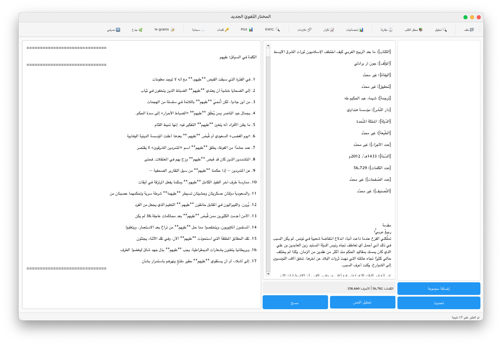
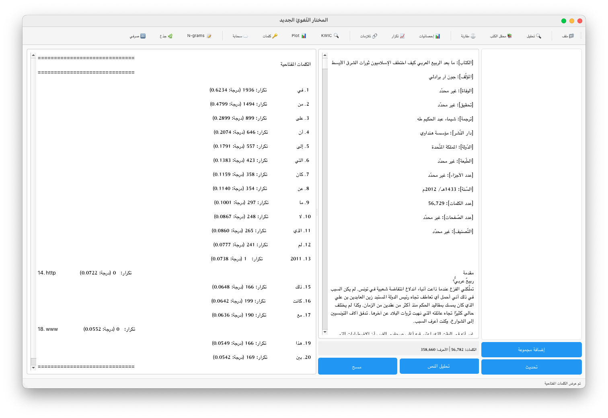

# المعالج اللغوي / Advanced Arabic Linguistic Processor

<div dir="rtl">

## نظرة عامة

برنامج متقدم وشامل لتحليل النصوص العربية مستوحى من AntConc و LancsBox. يوفر أدوات متقدمة لتحليل النصوص اللغوية العربية مع واجهة مستخدم رسومية حديثة.

## المميزات الأساسية

- 📊 **تحليل تكرار الكلمات**: عرض الكلمات الأكثر تكراراً مع النسب المئوية
- 📈 **إحصائيات نصية متقدمة**: إحصائيات شاملة للنص العربي
- 🔗 **تحليل التلازمات اللفظية**: 14 مقياس إحصائي متقدم (MI, T-Score, Log-Likelihood, إلخ)
- 📝 **تحليل N-grams**: البحث عن التسلسلات الشائعة
- ⚖️ **مقارنة النصوص**: مقارنة نصين لاكتشاف الفروقات

## المميزات المتقدمة

- 🔍 **KWIC (الكلمة في السياق)**: عرض الكلمات المستهدفة مع السياق المحيط
- 📊 **Plot (التمثيل البصري)**: مخططات توزيع الكلمات في النص
- 🔑 **تحليل الكلمات المفتاحية**: TF-IDF ومقارنة مع نصوص مرجعية
- ☁️ **سحابة الكلمات**: تمثيل بصري لتكرارات الكلمات
- 📚 **إدارة المجموعات النصية**: تحليل مجموعات كبيرة من النصوص
- 💾 **تصدير النتائج**: JSON, CSV, TXT, PNG
- 📖 **تحليل الكتب**: تحليل شامل للكتب النصية
- 🌳 **البحث عن الفروع**: استخراج الفروع من النصوص
- 🔤 **التحليل الصرفي**: تحليل صرفي متقدم للكلمات
- ☁️ **سحابة الكلمات المتقدمة**: تمثيلات بصرية متعددة

## التثبيت

### المتطلبات

- Python 3.7 أو أحدث
- جميع المكتبات المطلوبة موجودة في `requirements.txt`

### خطوات التثبيت

1. استنسخ المستودع:
```bash
git clone https://github.com/ayzem88/advanced-linguistic-processor.git
cd advanced-linguistic-processor
```

2. قم بتثبيت المتطلبات:
```bash
pip install -r requirements.txt
```

3. قم بتشغيل البرنامج:
```bash
python main.py
```

## لقطات الشاشة





## الاستخدام

### الخدمات الأساسية

1. افتح البرنامج
2. أدخل النص أو افتح ملف نصي
3. اضغط "تحليل النص"
4. استعرض النتائج في التبويبات:
   - **إحصائيات**: معلومات عامة عن النص
   - **تكرار الكلمات**: قائمة الكلمات الأكثر تكراراً
   - **التلازمات**: الكلمات التي تظهر معاً

### الخدمات المتقدمة

- **KWIC**: ابحث عن كلمة معينة واعرضها في السياق
- **Plot**: اعرض توزيع الكلمات بصرياً
- **كلمات مفتاحية**: حلل الكلمات المهمة في النص
- **سحابة الكلمات**: أنشئ تمثيلاً بصرياً للكلمات
- **تحليل الكتب**: حلل كتب كاملة مع إحصائيات مفصلة
- **البحث عن الفروع**: استخرج الفروع من النصوص
- **التحليل الصرفي**: حلل الكلمات صرفياً

## هيكل المشروع

```
المعالج اللغوي/
├── main.py                          # الملف الرئيسي
├── arabic_processor.py              # معالج النصوص العربية
├── requirements.txt                 # المتطلبات
├── config.json                      # ملف الإعدادات
├── features/                        # الميزات
│   ├── book_analyzer/              # محلل الكتب
│   ├── branches_search/            # البحث عن الفروع
│   ├── morphological_generation/    # التحليل الصرفي
│   └── wordcloud_analyzer/         # محلل سحابة الكلمات
├── utils/                           # الأدوات المساعدة
│   ├── advanced_logger.py          # نظام السجلات
│   ├── performance_optimizer.py    # محسن الأداء
│   └── settings_manager.py        # إدارة الإعدادات
├── cache/                           # ملفات التخزين المؤقت
├── logs/                            # ملفات السجلات
└── tests/                           # الاختبارات
```

## المكتبات المستخدمة

- **PyQt6**: واجهة المستخدم الرسومية
- **Matplotlib & Seaborn**: التمثيلات البصرية
- **NLTK**: معالجة اللغة الطبيعية
- **WordCloud**: سحب الكلمات
- **Scikit-learn**: خوارزميات التعلم الآلي
- **Pandas & NumPy**: معالجة البيانات
- **Arabic-Reshaper**: دعم النصوص العربية
- **Gensim**: نمذجة الموضوعات

## دعم اللغة العربية

البرنامج مُحسَّن خصيصاً للغة العربية ويشمل:
- معالجة النصوص العربية
- دعم التشكيل الكامل
- تحليل الصرف العربي المتقدم
- خطوط عربية للعرض
- دعم RTL (من اليمين لليسار)

## الإصدار

الإصدار الحالي: 3.0 Professional

## مقارنة مع AntConc و LancsBox

| الميزة | المعالج اللغوي | AntConc | LancsBox |
|--------|----------------|---------|----------|
| KWIC | ✅ | ✅ | ✅ |
| Plot | ✅ | ✅ | ✅ |
| Word List | ✅ | ✅ | ✅ |
| Keyword Analysis | ✅ | ✅ | ✅ |
| Collocates | ✅ | ✅ | ✅ |
| N-grams | ✅ | ✅ | ✅ |
| Wordcloud | ✅ | ❌ | ❌ |
| دعم العربية | ✅ | محدود | محدود |
| تحليل الكتب | ✅ | ❌ | ❌ |
| البحث عن الفروع | ✅ | ❌ | ❌ |
| التحليل الصرفي | ✅ | ❌ | ❌ |
| مجاني | ✅ | ✅ | ✅ |

## ملاحظات مهمة

⚠️ **ملاحظة**: بعض ملفات البيانات الكبيرة (قواعد البيانات والمدونات) غير مرفوعة في المستودع. يمكنك إضافة ملفاتك الخاصة في المجلدات المناسبة.

## التطوير المستقبلي

- [ ] دعم المزيد من صيغ الملفات
- [ ] تحسين الأداء للملفات الكبيرة
- [ ] إضافة المزيد من المقاييس الإحصائية
- [ ] واجهة مستخدم محسنة
- [ ] دعم التعلم الآلي المتقدم

## المساهمة

نرحب بمساهماتكم! يرجى قراءة [CONTRIBUTING.md](CONTRIBUTING.md) للمزيد من التفاصيل.

## الترخيص

## عن المطور

**أيمن الطيّب بن نجي** ([ayzem88](https://github.com/ayzem88))

خبير لغوي في معجم الدوحة التاريخي للغة العربية، مهتم بالأدوات والبرامج اللغوية، ومبرمج Vibe Coding.

🌐 **الموقع الشخصي**: [aymannji.com](https://www.aymannji.com/)

هذا المشروع مخصص للاستخدام الأكاديمي والبحثي.

## المطور

تم تطوير هذا المشروع بواسطة **أيمن الطيّب بن نجي** ([ayzem88](https://github.com/ayzem88))

---

# [English]

<div dir="ltr">

## Overview

An advanced and comprehensive program for analyzing Arabic texts inspired by AntConc and LancsBox. Provides advanced tools for analyzing Arabic linguistic texts with a modern graphical user interface.

## Basic Features

- 📊 **Word Frequency Analysis**: Display most frequent words with percentages
- 📈 **Advanced Text Statistics**: Comprehensive statistics for Arabic text
- 🔗 **Collocation Analysis**: 14 advanced statistical measures (MI, T-Score, Log-Likelihood, etc.)
- 📝 **N-grams Analysis**: Search for common sequences
- ⚖️ **Text Comparison**: Compare two texts to discover differences

## Advanced Features

- 🔍 **KWIC (Keyword in Context)**: Display target words with surrounding context
- 📊 **Plot (Visual Representation)**: Charts showing word distribution in text
- 🔑 **Keyword Analysis**: TF-IDF and comparison with reference texts
- ☁️ **Word Cloud**: Visual representation of word frequencies
- 📚 **Text Corpus Management**: Analyze large groups of texts
- 💾 **Export Results**: JSON, CSV, TXT, PNG
- 📖 **Book Analysis**: Comprehensive analysis of text books
- 🌳 **Branch Search**: Extract branches from texts
- 🔤 **Morphological Analysis**: Advanced morphological analysis of words
- ☁️ **Advanced Word Cloud**: Multiple visual representations

## Installation

### Requirements

- Python 3.7 or later
- All required libraries are in `requirements.txt`

### Installation Steps

1. Clone the repository:
```bash
git clone https://github.com/ayzem88/advanced-linguistic-processor.git
cd advanced-linguistic-processor
```

2. Install requirements:
```bash
pip install -r requirements.txt
```

3. Run the program:
```bash
python main.py
```

## Screenshots


## Usage

### Basic Services

1. Open the program
2. Enter text or open a text file
3. Click "Analyze Text"
4. Browse results in tabs:
   - **Statistics**: General information about the text
   - **Word Frequency**: List of most frequent words
   - **Collocations**: Words that appear together

### Advanced Services

- **KWIC**: Search for a specific word and display it in context
- **Plot**: Display word distribution visually
- **Keywords**: Analyze important words in the text
- **Word Cloud**: Create a visual representation of words
- **Book Analysis**: Analyze complete books with detailed statistics
- **Branch Search**: Extract branches from texts
- **Morphological Analysis**: Analyze words morphologically

## Project Structure

```
advanced-linguistic-processor/
├── main.py                          # Main file
├── arabic_processor.py              # Arabic text processor
├── requirements.txt                 # Requirements
├── config.json                        # Configuration file
├── features/                        # Features
│   ├── book_analyzer/              # Book analyzer
│   ├── branches_search/            # Branch search
│   ├── morphological_generation/    # Morphological analysis
│   └── wordcloud_analyzer/         # Word cloud analyzer
├── utils/                           # Helper utilities
│   ├── advanced_logger.py          # Logging system
│   ├── performance_optimizer.py    # Performance optimizer
│   └── settings_manager.py        # Settings manager
├── cache/                           # Cache files
├── logs/                            # Log files
└── tests/                           # Tests
```

## Libraries Used

- **PyQt6**: Graphical user interface
- **Matplotlib & Seaborn**: Visual representations
- **NLTK**: Natural language processing
- **WordCloud**: Word clouds
- **Scikit-learn**: Machine learning algorithms
- **Pandas & NumPy**: Data processing
- **Arabic-Reshaper**: Arabic text support
- **Gensim**: Topic modeling

## Arabic Language Support

The program is specifically optimized for Arabic and includes:
- Arabic text processing
- Full diacritical support
- Advanced Arabic morphological analysis
- Arabic fonts for display
- RTL (Right-to-Left) support

## Version

Current Version: 3.0 Professional

## Comparison with AntConc and LancsBox

| Feature | Linguistic Processor | AntConc | LancsBox |
|---------|---------------------|---------|----------|
| KWIC | ✅ | ✅ | ✅ |
| Plot | ✅ | ✅ | ✅ |
| Word List | ✅ | ✅ | ✅ |
| Keyword Analysis | ✅ | ✅ | ✅ |
| Collocates | ✅ | ✅ | ✅ |
| N-grams | ✅ | ✅ | ✅ |
| Wordcloud | ✅ | ❌ | ❌ |
| Arabic Support | ✅ | Limited | Limited |
| Book Analysis | ✅ | ❌ | ❌ |
| Branch Search | ✅ | ❌ | ❌ |
| Morphological Analysis | ✅ | ❌ | ❌ |
| Free | ✅ | ✅ | ✅ |

## Important Notes

⚠️ **Note**: Some large data files (databases and corpora) are not uploaded to the repository. You can add your own files in the appropriate folders.

## Future Development

- [ ] Support for more file formats
- [ ] Performance improvements for large files
- [ ] Add more statistical measures
- [ ] Enhanced user interface
- [ ] Advanced machine learning support

## Contributing

Contributions are welcome! Please read [CONTRIBUTING.md](CONTRIBUTING.md) for more details.

## License

This project is intended for academic and research use.

## About the Developer

**Ayman Atieb ben NJi** ([ayzem88](https://github.com/ayzem88))

Linguistic expert at the Historical Dictionary of the Arabic Language of Qatar (Doha Dictionary), interested in linguistic tools and software, and a Vibe Coding programmer.

🌐 **Personal Website**: [aymannji.com](https://www.aymannji.com/)

## Development Approach

I adopt the Vibe Coding paradigm in my software projects: rather than writing every line manually, I direct AI models with clear natural-language descriptions of the desired functionality, then evaluate and refine the generated code.

This approach accelerates prototype and module creation, allowing me to focus more on concept and design than on low-level implementation details.

In this repository you'll find tools and projects developed with this mindset — feel free to explore and contribute.

## Developer

Developed by **Ayman Atieb ben NJi** ([ayzem88](https://github.com/ayzem88))

</div>

